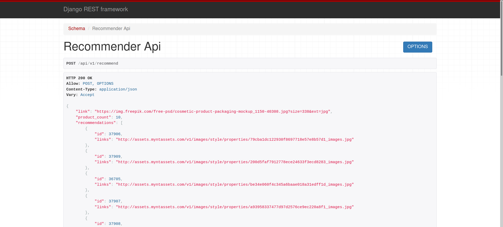

## Setup

## Setup

### For postgresql setup
> 1. for linux **sudo -u postres psql** 
> 2. CREATE DATABASE <DB_NAME>;
> 3. CREATE USER &lt;username&gt; WITH PASSWORD '<password>';
> 4. ALTER ROLE &lt;username&gt; SET client_encoding TO 'utf8';
> 5. ALTER ROLE &lt;username&gt; SET default_transaction_isolation TO 'read committed';
> 6. ALTER ROLE &lt;username&gt; SET timezone TO 'UTC';
> 7. GRANT ALL PRIVILEGES ON DATABASE <DB_NAME> TO &lt;username&gt;;

### DB config
create local_settings.py inside root directory and replace the following contents
<pre>
DATABASES = {
    'default': {
        'ENGINE': 'django.db.backends.postgresql',
        'NAME': '&lt;DB_NAME&gt;',
        'USER': '&lt;username&gt;',
        'PASSWORD': '&lt;password&gt;',
        'HOST': 'localhost',
        'PORT': '5432'
    }
}
</pre>

### Clone and install packages
> 1. https://github.com/cipher10111/cosmetigo-recommendation.git
> 2. cd cosmetigo-recommendation
> 3. for linux **python3 -m venv ./venv**
> 4. source venv/bin/activate
> 4. pip install -r requirements.txt 
> 5. source .env

## Run the server

> 1. ./manage.py makemigrations
> 2. ./manage.py migrate
> 3. ./manage.py createsuperuser
> 4. ./manage.py runserver

## Demo

<a href="https://drive.google.com/file/d/1MxufKD4g0000cTvq67hjRfjGx59RyVX8/view?usp=sharing">
  

    
  

</a>

## Live Preview
[You can check the api here](http://18.222.147.216/api/v1/recommend)